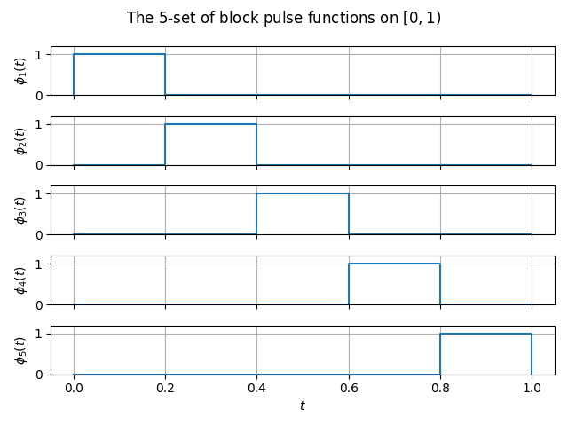

========
Theory
========

Introduction
------------

We present a numerical method for solving stochastic Volterra integral equations
based on block pulse functions and a stochastic operational matrix of
integration as suggested in [1]_. By applying this method the problem is reduced
to solve a linear lower triangular system.

Basics
------

First we briefly introduce some basic properties about block pulse functions
and function / integral approximation with them. Then we focus on repeating some
results about random variables, conditional expectation, martingales and give a
short reminder about the construction of the itô-integral. For details we refer
to [2]_.

Block pulse functions
~~~~~~~~~~~~~~~~~~~~~

We consider an interval :math:`[0, T)` and divide it in :math:`m` intervals with
a width of :math:`h = \frac{T}{m}`. An :math:`m`-set of block pulse functions
is then defined as the indicator functions of the intervals
:math:`[(i-1)h, ih]`:

.. rubric:: Definition

A family :math:`\Phi = ( \phi_i )_{ i=1 , \ldots , m}` of functions
:math:`\phi_i \colon [0, T) \to \{0, 1\}` with

.. math::

    \phi_i(t) = \begin{cases} 1 & , \ (i-1)h \leq t < ih \\ 0 &
    \text{otherwise} \end{cases} \qquad (i=1,\ldots,m)

is called an :math:`m`-**set of block pulse functions**.

-----

The BPF's are

+ **disjoint** i.e. 

  .. math::

    \phi_i(t)\phi_j(t) = \delta_{ij} \phi_i(t),

  for :math:`i,j = 1, \ldots, m` and :math:`\delta_{ij}` the Kronecker delta

+ **orthogonal**, i.e.

  .. math::

    \int\limits_0^T \phi_i(t) \phi_j(t) dt = h \delta_{ij},

  for for :math:`i,j=1,\ldots,m`

+ **complete**, i.e. 

  .. math::

    \frac{1}{T} \int\limits_0^T \left[ f(s) - \sum\limits_{k=0}^m f_j \phi_i(s) \right]^2 ds

  decreases monotonically to zero as :math:`m` tends to infinity, where

  .. math::

    f_i = \frac{1}{h} \int\limits_0^T f(s) \phi_i(s) ds

  are the so called **block pulse coefficients**.

.. rubric:: Function approximation

Let :math:`f \colon [0,T) \to \mathbb{R}` be a real-valued and square integrable
function. Then :math:`f` can be approximated by

.. math::

    f(t) \simeq \hat{f}_m (t) = \sum\limits_{i=0}^m f_i \phi_i (t),

where :math:`f_i` is the :math:`i`-th block pulse coefficients. 

.. math::

    f(t) \simeq \hat{f}_m (t) = F^T \Phi (t) = \Phi^T (t) F

with :math:`F = \left( f_1 , \ldots, f_m \right)` the block pulse coefficients
vector and :math:`\Phi (t) = \left( \phi_1 (t) , \ldots, \phi_m (t) \right)` the
block pulse function vector.

.. rubric:: Integral approximation

more to come ...

Conditional expectation 
~~~~~~~~~~~~~~~~~~~~~~~

Given are a probability space :math:`(\Omega, \mathcal{A}, P)`, a
sub-:math:`\sigma`-Algebra :math:`\mathcal{F} \subset \mathcal{A}` and an
integrable random variable :math:`X \in \mathcal{L}^1(\Omega, \mathcal{A}, P)`.

.. rubric:: Definition

A random variable :math:`Y` is called **conditional expectation** of :math:`X`
given :math:`\mathcal{F}`, in symbols :math:`E(X|\mathcal{F}) := Y`, if

.. hlist:: 
    :columns: 1

    * :math:`Y` is measurable with respect to :math:`F`
    * :math:`E(X \mathbb{1}_A) = E(Y \mathbb{1}_A)` for all :math:`A \in \mathcal{F}`.

------------

Any random variable :math:`Y` satisfying these two conditions is called a
**version** of :math:`E(X|\mathcal{F})`. All these equations are equations in
the almost sure sense.

Brownian Motion
~~~~~~~~~~~~~~~

.. rubric:: Definition

A stochastic process :math:`(B_t)_{t \geq 0}` is called a **Brownian motion** if
it satisfies the following conditions

.. hlist::
    :columns: 1

    * :math:`B_0 = 0`
    * :math:`B` has independent and stationary increments
    * :math:`B_t \sim \mathcal{N}(0,t)` for :math:`t > 0`
    * :math:`t \mapsto B_t` is a.s. continuous.

------

Itô-Integral
~~~~~~~~~~~~

Stochastic integration operational matrix
-----------------------------------------

Numerical solution of stochastic Volterra integral equations
-------------------------------------------------------------

We consider the following stochastic Volterra integral equation

.. math::

    X(t) = f(t) + \int\limits_0^t k_1(s,t) X_s ds + \int\limits_0^t k_2(s,t) X_s dB_s, \qquad t \in [0,T).

Examples
--------

We applied the method presented above to the following three examples.

Example 1
~~~~~~~~~

We consider the following stochastic Volterra integral equation

.. math::

    X_t = 1 + \int\limits_0^t s^2 X_s ds + \int\limits_0^t s X_s dB_s, \qquad t \in [0, 0.5),

so :math:`f \equiv 1`, :math:`k_1(s,t) = s^2`, :math:`k_2(s,t) = s` and :math:`T=0.5`.

Example 2
~~~~~~~~~

We consider the following stochastic Volterra integral equation

.. math::

    X_t = \frac{1}{12} + \int_0^t \cos (s) X_s ds + \int_0^t \sin (s) X_s dB_s, \qquad t \in [0, 0.5),

so :math:`f \equiv \frac{1}{12}`, :math:`k_1(s,t) = \cos(s)`, :math:`k_2(s,t) = \sin(s)` and :math:`T=0.5`.

Example 3
~~~~~~~~~

We consider the following stochastic Volterra integral equation

.. math::

    X_t = \frac{1}{3} + \int_0^t \ln (s+1) X_s ds + \int_0^t \sqrt{\ln (s+1)} X_s dB_s \qquad t \in [0, 1),

so :math:`f \equiv \frac{1}{3}`, :math:`k_1(s,t) = \ln (s+1)`, :math:`k_2(s,t) = \sqrt{\ln (s+1)}` and :math:`T=1`.

Applications
------------

References
----------

.. [1] Maleknejad, K., Khodabin, M., & Rostami, M. (2012). Numerical solution of stochastic Volterra integral equations by a stochastic operational matrix based on block pulse functions. Mathematical and computer Modelling, 55(3-4), 791-800. |maleknejad-et-al-2012-doi|    

.. [2] Durrett, R. (2019). Probability: Theory and Examples (5th ed., Cambridge Series in Statistical and Probabilistic Mathematics). Cambridge: Cambridge University Press. |durrett-doi|

.. |maleknejad-et-al-2012-doi| image:: https://img.shields.io/badge/DOI-10.1016%2Fj.mcm.2011.08.053-blue
		:target: https://doi.org/10.1016/j.mcm.2011.08.053
		:alt: doi: 10.1016/j.mcm.2011.08.053

.. |durrett-doi| image:: https://img.shields.io/badge/DOI-10.1017%2F9781108591034-blue
		:target: https://doi.org/10.1017/9781108591034
		:alt: doi: 10.1017/9781108591034
